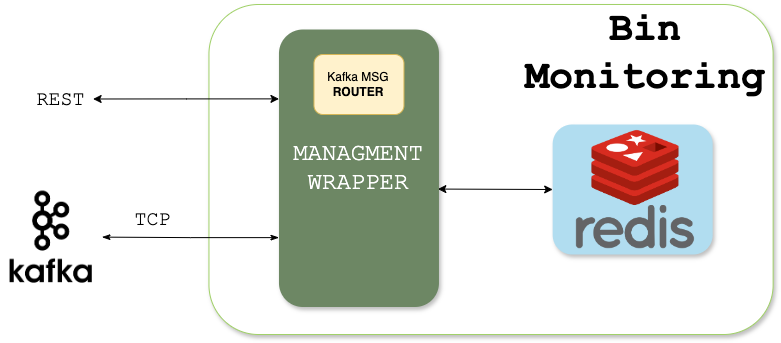

#  `W.A.S.T.E.` — Waste Automation System for Tracking and Efficiency

**WASTE** (Waste Automation System for Tracking and Efficiency) is a smart waste management system that combines IoT, real-time data streams, routing optimization, and user interaction to support efficient garbage collection and environmental awareness. The platform is modular, containerized, and fully deployed on a Kubernetes cluster at the University of Aveiro.

---

## Project Structure and Architecture

The system follows a **Service-Oriented Architecture (SOA)** with microservices for:
- Bin Monitoring
- Route Optimization
- NFC Logging
- Real-time WebSocket Bridge
- Backend for user and bin management
- A Flutter-based frontend application

Services communicate via REST and Kafka, and are exposed externally through an API Gateway powered by Kong.

###  General Architecture

  

###  Frontend Architecture

  

###  Bin Monitoring Module

  

###  Routes Service

  

###  NFC Logging Module

  

---

## Deployment `- Kubernetes -`

All services were deployed in the `waste-app` namespace of the Kubernetes cluster hosted at the University of Aveiro. Each service is containerized (Docker) and deployed with the appropriate configuration, secrets, and volumes.

> Although individual ingress resources were created during development, the final production environment is routed through **Kong**, which serves as the unified API Gateway.

### 🧱 Deployment Diagram

  

### Deployment Summary Table

| Pod           | Deployment | Service | ConfigMap | Secret | Ingress | Volumes | Working |
|---------------|------------|---------|-----------|--------|---------|---------|---------|
| posting       | ✅         | ✅      |           |        |         |         | ✅       |
| routesAPI     | ✅         | ✅      | ✅        | ✅     | ✅      |         | ✅       |
| db-routes     | ✅         | ✅      |           |        |         | PVC     | ✅       |
| binMonitoring | ✅         | ✅      | ✅        | ✅     | ✅      |         | ✅       |
| kafka         | ✅         | ✅      |           |        |         |         | ✅       |
| redis         | ✅         | ✅      |           |        |         | PVC     | ✅       |
| kong          | ✅         | ✅      | ✅        |        | ✅      |         | ✅       |
| backend       | ✅         | ✅      |           | ✅     | ✅      |         | ✅       |
| bridge        | ✅         | ✅      |           | ✅     |         |         | ✅       |
| mariadb       | ✅         | ✅      | ✅        |        |         | PVC     | ✅       |

✅ = component configured and required  
PVC = persistent volume claim used for database persistence

---

## Team

| Name               | GitHub                                      |
|--------------------|---------------------------------------------|
| Pedro Carneiro     | [@pedromtcarneiro](https://github.com/pedromtcarneiro) |
| Inês Águia         | [@inesaguia](https://github.com/inesaguia) |
| Leandro Rito       | [@leandro-rito](https://github.com/Strikeneerman) |

---

## Notes

- The system was tested using simulated bin sensors and NFC tag readers.
- The frontend is developed in Flutter and supports authentication via Google and GitHub using Firebase Authentication.
- The backend is exposed through Kong and uses MariaDB as the main storage engine.

---

## Future Work

- Sorting bins by proximity to the user.
- Enhancing the reward system.
- Real-time garbage truck tracking.
- Integrating all interfaces into a single mobile app.
- Allowing users to submit feedback directly from the app.

---